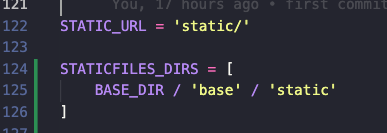

# django-basico

O objetivo desse repositorio é experimentar o framework django.

Comandos para trabalhar com django:

- **django-admin startproject nomepasta .** (Obs: . indica que o arquivo principal chamado manage.py estará na raiz do projeto)
- Para executar o projeto: **python manage.py runserver**

Django trabalha baseado em Apps:

- App é um conjunto de funcionalidades interrelacionadas que são definidas para criar ou manter um aspecto do projeto.
- criar uma app: **python manage.py startapp**

Comando help:

- **python manage.py --help**

Ao criar um app, precisamos cadastrá-lo em settings.py -> INSTALLED_APPS

por default, pastas com nomes de templates e static ja são procurados pelo django graças a config em settings.py, caso seja necessário
criar outras pastas na raiz por exemplo, precisamos cadastrá-lo em settings.py.  

